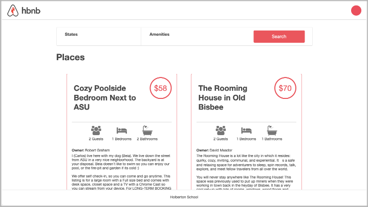

# HBnB - AirBnB Clone v4
HBnB is a full-stack AirBnB clone, created in stages over the course of three months as part of the curriculum at Holberton School. The application frontend consists of a dynamic website created using HTML, CSS, and jQuery and run on a Flask framework. Data is served to the site from an API which is also implemented with Flask. The application backend consits of a console for command line manipulation, a storage engine, and data models. Data persistence is handled using SQLAlchemy and MySQL. A suite of unittests were also built to test the application's backend.

## Table of Contents
* [Environment](#environment)
* [Installation](#installation)
* [Usage](#usage)
* [The Console](#the-console)
    * [Functionalities](#console_func)
    * [File Descriptions](#console_files)
    * [Examples of Use](#console_ex)
* [REST API](#rest_api)
    * [Functionalities](#api_func)
    * [File Descriptions](#api_files)
    * [Examples](#api_ex)
* [Web Dynamic](#web-dynamic)
    * [Functionalities](#dynamic_func)
    * [File Descriptions](#dynamic_files)
    * [Examples](#dynamic_ex)
* [Bugs](#bugs)
* [Authors](#authors)
* [License](#license)

## Environment
This project is interpreted/tested on Ubuntu 14.04 LTS using python3 (version 3.4.3).

## Installation
* Clone this repository: `git clone "https://github.com/michellegsld/AirBnB_clone_v4"`
* Access AirBnb directory: `cd AirBnB_clone_v4`
* Run hbnb(interactively): `./console` and enter command
* Run hbnb(non-interactively): `echo "<command>" | ./console.py`

## The Console
The first stage of the HBnB project was implementing a console and data models. The console was written with python v3.4 and served to manipulate data from the command line. A file storage system was also put in place to handle persistence until a database system could be built.

### Functionalities <a id="console_func"></a>
* Create a new object (ex: a new User or a new Place)
* Retrieve an object from a file, a database etc...
* Do operations on objects (count, compute stats, etc...)
* Update attributes of an object
* Destroy an object

### File Descriptions <a id="console_files"></a>
[console.py](console.py) - the console command interpreter 
List of commands this console current supports:
* `EOF` - exits console 
* `quit` - exits console
* `<emptyline>` - overwrites default emptyline method and does nothing
* `create` - Creates a new instance of`BaseModel`, saves it (to the JSON file) and prints the id
* `destroy` - Deletes an instance based on the class name and id (save the change into the JSON file). 
* `show` - Prints the string representation of an instance based on the class name and id.
* `all` - Prints all string representation of all instances based or not on the class name. 
* `update` - Updates an instance based on the class name and id by adding or updating attribute (save the change into the JSON file). 

#### `models/` directory contains classes used for this project:
[base_model.py](/models/base_model.py) - A base class from which other models classes inherit
Classes inheriting from BaseModel:
* [amenity.py](/models/amenity.py)
* [city.py](/models/city.py)
* [place.py](/models/place.py)
* [review.py](/models/review.py)
* [state.py](/models/state.py)
* [user.py](/models/user.py)

#### `/models/engine` directory contains File Storage class that handles JSON serialization and deserialization :
[file_storage.py](/models/engine/file_storage.py) - Serializes/deserializes data to and from JSON file

### Examples of Use <a id="console_ex"></a>
```
vagrantAirBnB_clone$./console.py
(hbnb) help

Documented commands (type help <topic>):
========================================
EOF  all  create  destroy  help  quit  show  update

(hbnb) all MyModel
** class doesn't exist **
(hbnb) create BaseModel
7da56403-cc45-4f1c-ad32-bfafeb2bb050
(hbnb) all BaseModel
[[BaseModel] (7da56403-cc45-4f1c-ad32-bfafeb2bb050) {'updated_at': datetime.datetime(2017, 9, 28, 9, 50, 46, 772167), 'id': '7da56403-cc45-4f1c-ad32-bfafeb2bb050', 'created_at': datetime.datetime(2017, 9, 28, 9, 50, 46, 772123)}]
(hbnb) show BaseModel 7da56403-cc45-4f1c-ad32-bfafeb2bb050
[BaseModel] (7da56403-cc45-4f1c-ad32-bfafeb2bb050) {'updated_at': datetime.datetime(2017, 9, 28, 9, 50, 46, 772167), 'id': '7da56403-cc45-4f1c-ad32-bfafeb2bb050', 'created_at': datetime.datetime(2017, 9, 28, 9, 50, 46, 772123)}
(hbnb) destroy BaseModel 7da56403-cc45-4f1c-ad32-bfafeb2bb050
(hbnb) show BaseModel 7da56403-cc45-4f1c-ad32-bfafeb2bb050
** no instance found **
(hbnb) quit
```

## REST API
The HBnB REST API was constructed during an intermediate stage of the project. The API provides allows frontend applications to retrieve and manipulate data through backend storage engines using the standardized REST methods. This key feature will help facilitate a shift in the project's final stage from using Jinja to jQuery to dynamically serve web content.

### Functionalities <a id="api_func"></a>
* Allow frontend access to application data
* Accept standard RESTful methods GET, POST, DELETE, and PUT
* Facilitate seamless intergration of future and/or third-party applications

### File Descriptions <a id="api_files"></a>
All scripts comprising the HBnB API are found in the directory `api/v1/`.

[app.py](api/v1/app.py) - Base application script, includes configurations and run command.

[api/v1/views/](api/v1/views/) - Scripts to define Flask blueprint and routings to API endpoints.

### Examples <a id="api_ex"></a>
Run this command to host the API application:
```
HBNB_MYSQL_USER=hbnb_dev HBNB_MYSQL_PWD=hbnb_dev_pwd HBNB_MYSQL_HOST=localhost HBNB_MYSQL_DB=hbnb_dev_db HBNB_TYPE_STORAGE=db HBNB_API_PORT=5001 python3 -m api.v1.app
```

## Web Dynamic
Web dynamic was the final stage of the HBnB project. The goal at this stage was to deploy a final, dynamic version of the HBnB webiste. Data is loaded on the backend, passed to the client through the REST API, and dynamically populated to the site using jQuery. The website itself is deployed with a Flask framework.

### Functionalities <a id="dynamic_func"></a>
* Display all places within the database
* Filter search for places by state, city, and amenities
* Toggle reviews attached to each place
* Display API status indicator
    * Grey when connected
    * Red when not connected




### File Descriptions <a id="dynamic_files"></a>
All the scripts and content created for this final version of HBnB is found in the directory `web_dynamic/`.

#### Files that work together to create the final website:
[101-hbnb.py](web_dynamic/101-hbnb.py) - The Flask script used to deploy the final website. Routes requests and renders HTML template.
Located in: `web_dynamic/101-hbnb.py`

[101-hbnb.html](web_dynamic/templates/101-hbnb.html) - The HTML template used for the website. It was simplified and calls upon a jQuery script instead to load the rest of the website. Basically a template to be populated with data.
Located in: `web_dynamic/templates/101-hbnb.py`

[101-hbnb.js](web_dynamic/static/scripts/101-hbnb.js) - The final jQuery script used to dynamically populate the HTML template with data drawn from the API.
Located in: `web_dynamic/static/scripts/101-hbnb.js`

#### Other Directories:
* `web_dynamic/` - Contains versions of the `*-hbnb.py` Flask script.
* `web_dynamic/templates/` - Contains iterations of the `*-hbnb.html` HTML templates.
* `web_dynamic/static/scripts/` - Contains versions of the `*-hbnb.js` jQuery scripts.
* `web_dynamic/static/styles/` - Contains all CSS stylesheets.
* `web_dynamic/static/images/` - Contains the websites static contents.

### Examples <a id="dynamic_ex"></a>
Run this command to host the website:
```
HBNB_MYSQL_USER=hbnb_dev HBNB_MYSQL_PWD=hbnb_dev_pwd HBNB_MYSQL_HOST=localhost HBNB_MYSQL_DB=hbnb_dev_db HBNB_TYPE_STORAGE=db python3 -m web_dynamic.101-hbnb
```

## Bugs
No known bugs at this time. 

## Authors
Michelle Giraldo - [Github](https://github.com/michellegsld) / [Twitter](https://twitter.com/michellegsld)  
Jennifer Huang - [Github](https://github.com/jhuang10123) / [Twitter](https://twitter.com/earthtojhuang)  
Justin Majetich - [Github](https://github.com/justinmajetich) / [Twitter](https://twitter.com/JustinMajetich)  
Alexa Orrico - [Github](https://github.com/alexaorrico) / [Twitter](https://twitter.com/alexa_orrico)  
David Ovalle - [Github](https://github.com/Nukemenonai) / [Twitter](https://twitter.com/disartDave)  
Jhoan Zamora - [Github](https://github.com/jzamora5) / [Twitter](https://twitter.com/JhoanZamora10)  

## License
Public Domain. No copy write protection. 
